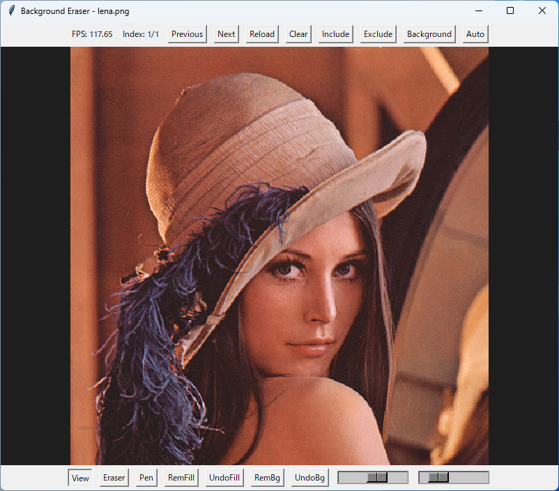
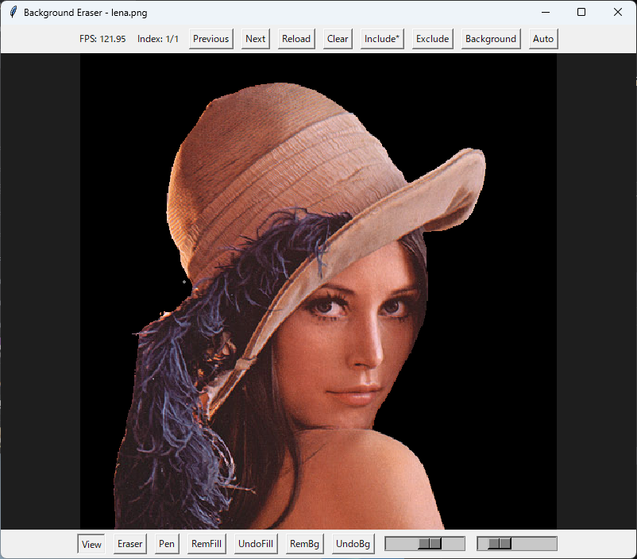

# Background Eraser

This is a tool for making the background of a large number of images transparent.
It uses U2Net for background removal but also allows for manual adjustments.
It is primarily used for creating AI training data.

[English](README.md) | 日本語




## Usage

```bash
git clone https://github.com/fa0311/background_erase.git
cd background_erase
pip install -r requirements.txt
python main.py
```

## Features

### Navigation

- *Previous* Move to the previous image
- *Next* Move to the next image
- *Reload* Return to the state before saving
- *Clear* Revert all background transparency
- *Include* Save the transparent image to the Include folder
- *Exclude* Save the transparent image to the Exclude folder
- *Backgroud* Display the boundary line
- *Auto* Automatically make all images' backgrounds transparent using U2Net

### Editing

- *View* View mode
- *Erase* Manually remove the background using an eraser
- *Pen* Restore the removed background with a pen
- *RemFill* Remove background using surrounding colors as reference
- *UndoFill* Restore background using surrounding colors as reference
- *RemBg* Remove the background using U2Net
- *UndoBg* Restore the background removed by U2Net

## Shortcuts

- *Space* Save the transparent image to the Include folder
- *Left, A* Move to the previous image
- *Right, D* Move to the next image
- *Z* Return to the state before saving
